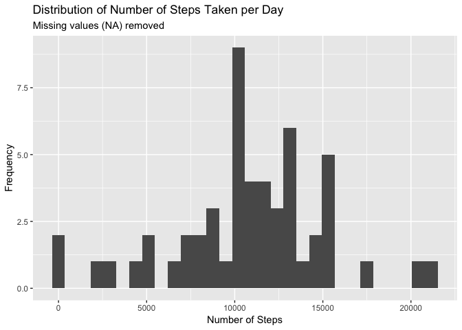
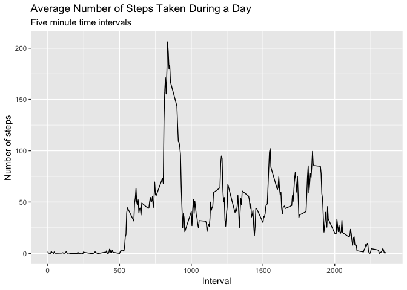
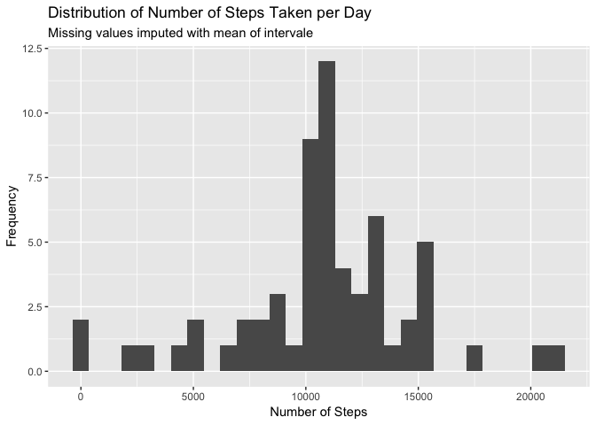
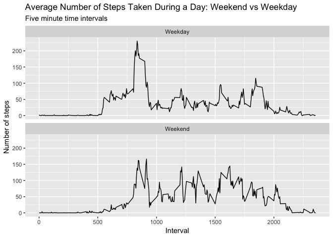

## Load the required packages

```r
library(tidyverse)
library(ggplot2)
```


## Loading and preprocessing the data

```r
activity <- readr::read_csv('activity.csv') 
```

---

## What is mean total number of steps taken per day?
1. Make a histogram of the total number of steps taken each day

```r
activity %>%
  na.omit() %>% # removes NAs
  group_by(date) %>% # group by date is equiv to by day
  summarize(steps = sum(steps)) %>%
  ggplot(aes(x = steps)) +
  geom_histogram(bins = 30) + 
  labs(title = 'Distribution of Number of Steps Taken per Day'
       , subtitle = 'Missing values (NA) removed'
       , y = 'Frequency'
       , x = 'Number of Steps')
```

<!-- -->

2. Calculate and report the mean and median total number of steps taken per day

```r
activity %>%
  na.omit() %>%
  group_by(date) %>%
  summarize(steps = sum(steps)) %>%
  summarize('Mean Steps per Day' = mean(steps)
            , 'Median Steps per Day' =  median(steps))
```

```
## # A tibble: 1 x 2
##   `Mean Steps per Day` `Median Steps per Day`
##                  <dbl>                  <dbl>
## 1               10766.                  10765
```

---

## What is the average daily activity pattern?
1. Make a time series plot (i.e. type = "l") of the 5-minute interval (x-axis) and the average number of steps taken, averaged across all days (y-axis)

```r
activity %>%
  na.omit() %>%
  group_by(interval) %>%
  summarize(steps = mean(steps)) %>% # mean = average
  ggplot(aes(x = interval, y = steps)) +
  geom_line() +
  labs(title = 'Average Number of Steps Taken During a Day'
       , subtitle = 'Five minute time intervals'
       , y = 'Number of steps'
       , x = 'Interval')
```

<!-- -->


2. Which 5-minute interval, on average across all the days in the dataset, contains the maximum number of steps?

```r
activity %>%
  na.omit() %>%
  group_by(interval) %>%
  summarize(steps = mean(steps)) %>%  # mean = average
  arrange(desc(steps)) %>% # arrange in descending order of steps: first element is most steps in an interval
  head(1) # only show the interval with the most steps
```

```
## # A tibble: 1 x 2
##   interval steps
##      <dbl> <dbl>
## 1      835  206.
```

---

## Imputing missing values
1. Calculate and report the total number of missing values in the dataset (i.e. the total number of rows with NAs)

```r
activity %>%
  summarise('Missing (NA) Date' = sum(is.na(date))
            , 'Missing (NA) Steps' = sum(is.na(steps))
            , 'Missing (NA) Interval' = sum(is.na(interval)))
```

```
## # A tibble: 1 x 3
##   `Missing (NA) Date` `Missing (NA) Steps` `Missing (NA) Interval`
##                 <int>                <int>                   <int>
## 1                   0                 2304                       0
```


2. Devise a strategy for filling in all of the missing values in the dataset. The strategy does not need to be sophisticated. For example, you could use the mean/median for that day, or the mean for that 5-minute interval, etc.
- I am going to use the average value for each interval.

3. Create a new dataset that is equal to the original dataset but with the missing data filled in

```r
imp_activity <- activity %>%
  group_by(interval) %>%
  mutate_if(is.numeric, function(x) ifelse(is.na(x), mean(x, na.rm = TRUE), x))
```

4. Make a histogram of the total number of steps taken each day and Calculate and report the mean and median total number of steps taken per day. Do these values differ from the estimates from the first part of the assignment? What is the impact of imputing missing data on the estimates of the total daily number of steps?

```r
imp_activity %>%
  group_by(date) %>%
  summarize(steps = sum(steps)) %>%
  ggplot(aes(x = steps)) +
  geom_histogram(bins = 30) + 
  labs(title = 'Distribution of Number of Steps Taken per Day'
       , subtitle = 'Missing values imputed with mean of intervale'
       , y = 'Frequency'
       , x = 'Number of Steps')
```

<!-- -->

```r
imp_activity %>%
  na.omit() %>%
  group_by(date) %>%
  summarize(steps = sum(steps)) %>%
  summarize('Mean Steps per Day' = mean(steps)
            , 'Median Steps per Day' =  median(steps))
```

```
## # A tibble: 1 x 2
##   `Mean Steps per Day` `Median Steps per Day`
##                  <dbl>                  <dbl>
## 1               10766.                 10766.
```
> The key differences between the imputed and non-imputed charts is the frequency at which we see total number of steps per day. The distribution becomes somewhat less variable with the most common number of steps increasing in frequency. That being said, the distribution does not change its center much, with mean and median remaining very similar.

---

## Are there differences in activity patterns between weekdays and weekends?
1. Create a new factor variable in the dataset with two levels – “weekday” and “weekend” indicating whether a given date is a weekday or weekend day.

```r
# For ease of the next step, I am going to add this new factor as a column to the new data set
imp_activity <- imp_activity %>%
  mutate(isWeekend = weekdays(date) %in% c('Saturday', 'Sunday')) %>%
  mutate(isWeekend = replace(isWeekend, isWeekend == TRUE, 'Weekend')) %>%
  mutate(isWeekend = replace(isWeekend, isWeekend == FALSE, 'Weekday'))
```


2. Make a panel plot containing a time series plot (i.e. type = "l") of the 5-minute interval (x-axis) and the average number of steps taken, averaged across all weekday days or weekend days (y-axis). The plot should look something like the following, which was creating using simulated data:

```r
imp_activity %>%
  group_by(interval, isWeekend) %>%
  summarize(steps = mean(steps)) %>%
  ggplot(aes(x = interval, y = steps)) +
  facet_wrap(isWeekend ~ ., ncol=1, nrow=2) +
  geom_line() +
  labs(title = 'Average Number of Steps Taken During a Day: Weekend vs Weekday'
       , subtitle = 'Five minute time intervals'
       , y = 'Number of steps'
       , x = 'Interval')
```

<!-- -->
